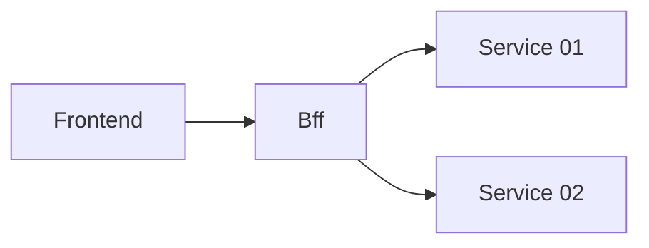

# k8s-frontend-bff

### Schema



## Not secure architecture 

```bash
open http://localhost:8080
docker compose up
```


## k8s Installation


```bash
minikube start
minikube addons enable ingress
minikube addons enable ingress-dns
kubectl apply -f https://github.com/cert-manager/cert-manager/releases/download/v1.15.3/cert-manager.yaml
```

## References

* https://blog.kronis.dev/tutorials/how-to-use-nginx-to-proxy-your-front-end-and-back-end

